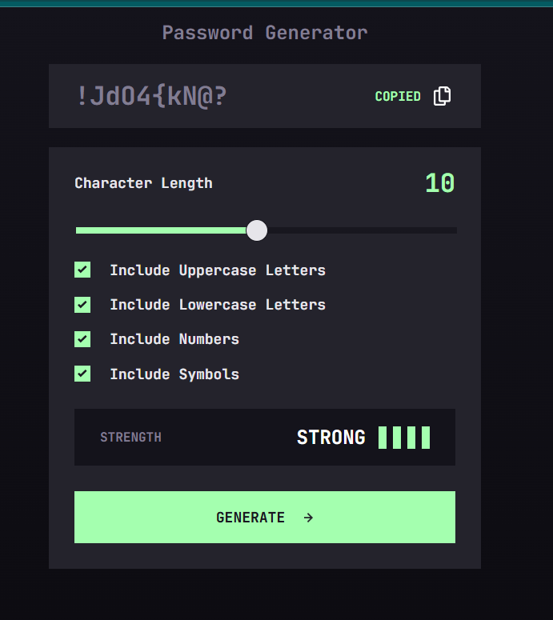

# Password Generator App

A responsive password generator built with HTML, CSS, and JavaScript.  
The app lets users choose password length and character types (uppercase, lowercase, numbers, symbols), generate a secure password, copy it to clipboard, and see a live strength indicator.

## What I built

- Custom UI based on the Frontend Mentor design.
- Password generation logic with guaranteed inclusion of selected character types.
- Cryptographically secure randomness using `crypto.getRandomValues()`.
- Dynamic strength meter based on estimated entropy.
- Copy-to-clipboard interaction with user feedback.

## What I learned

- How to structure JavaScript logic into small reusable functions.
- How to improve password quality by using secure random APIs instead of `Math.random()`.
- How to estimate password strength using entropy (`length * log2(characterPool)`).
- How to handle edge cases (like invalid option combinations) and keep UX clear.

## Screenshot

